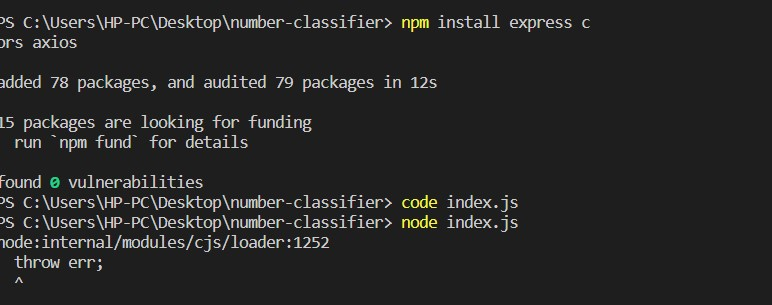
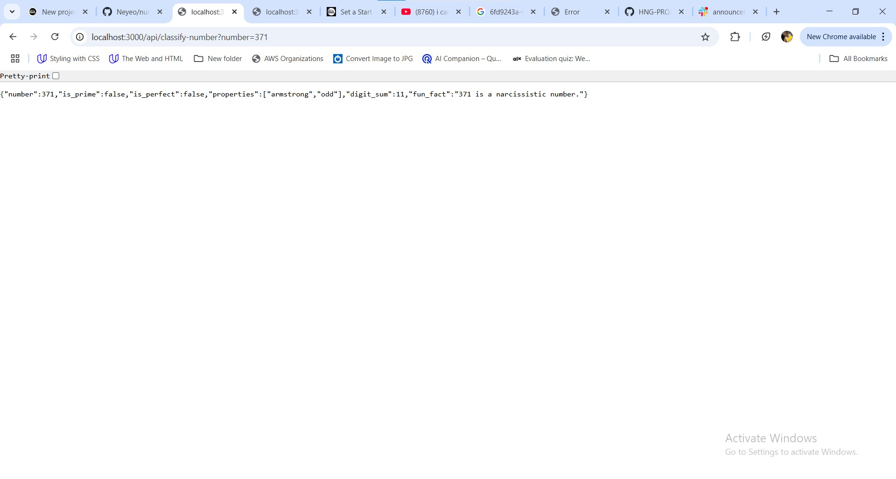
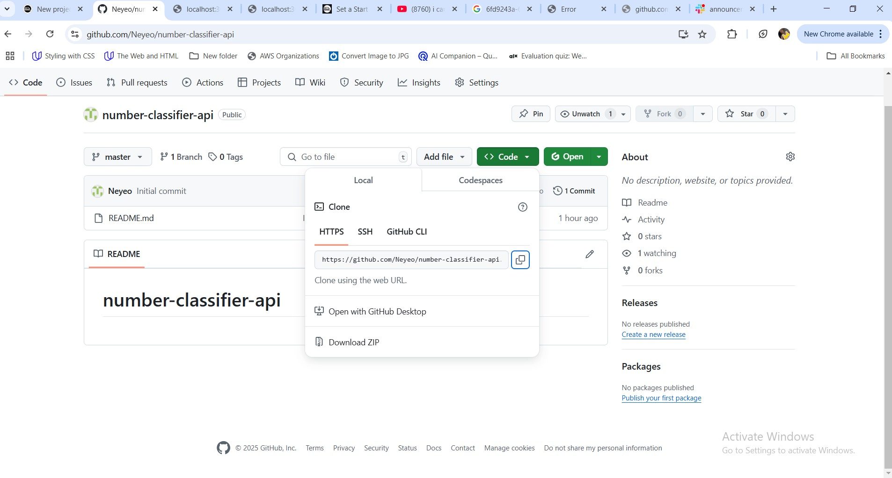
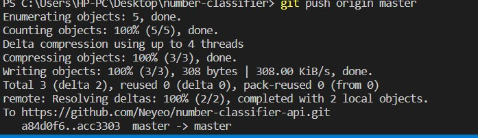
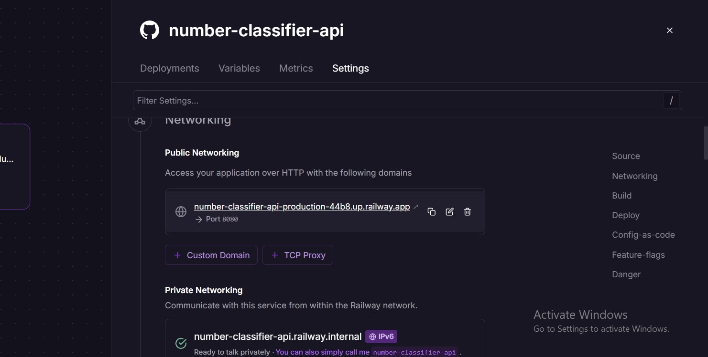
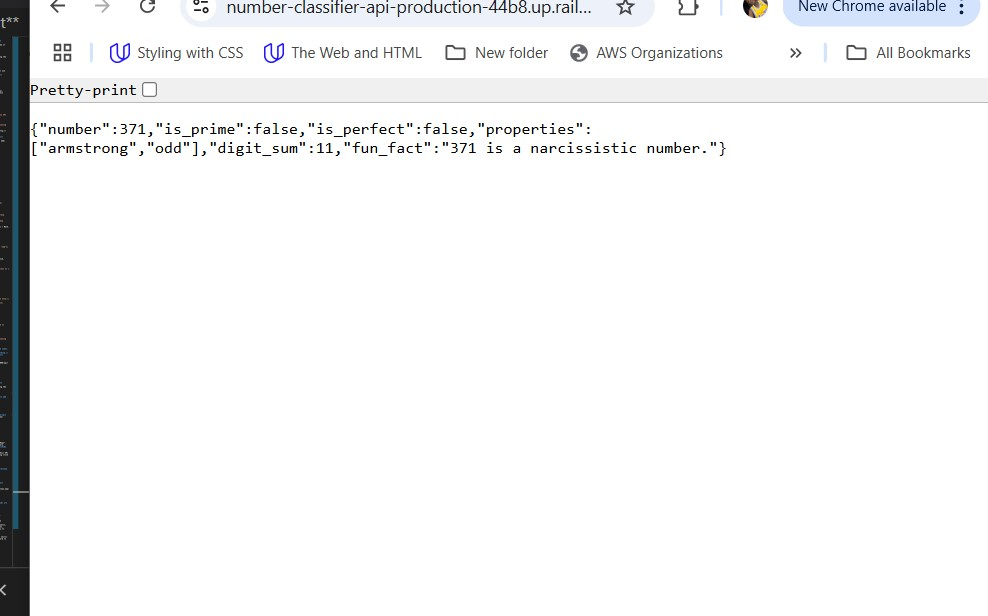

 # **Numner Classsifcation API**

## **Introduction**
The Number Classification API is a simple yet powerful web service designed to classify numbers based on their mathematical properties. Given an integer input, this API evaluates its characteristics, such as whether it's a prime number, a perfect number, or an Armstrong number (also known as a narcissistic number). It also calculates the sum of its digits and provides an interesting fun fact about the number.

### **Project Overview**.
The Number Classification API is a simple web service that classifies numbers based on their mathematical properties. It evaluates whether a given number is prime, perfect, or Armstrong (narcissistic), calculates the sum of its digits, and provides an interesting fun fact. Built using Node.js and Express.js, the API is deployed on Railway for easy, public access. It's a lightweight and fast tool for exploring the properties of integers, ideal for educational, research, or trivia purposes.

### **Technologies Used**
- **javaScript (Node.js)**: Programming Language.
- **Framework: Express.js**: For handling HTTPS request and building the API.
- **DEPLOYMENT: Railway**: For deploying the application and making it publicly accessible.
- **Version Control**: Git 
- **Package Manager**: npm to manage dependencies 
- **Math operations**: Standard JavaScript functions for mathematical computations


## **Setup  the project**

### **1. Initialize a new Node.js project**

#### **Step 1: create a new folder and chnage directory to it**
- On your desktop create a new folder and name it number-classifier-api.


- On vs code terminal cd into the folder using the command **cd number-classifier-api**
**Initialize a package.json**.
- using the command **npm init -y**.


- **Install necessary dependencies**: We will use express to handle the API routes.
- Using the command **npm install express cors axios**



#### **Step 2: Create the API**

#### **Step 1: Create a index.js File**
- Navigate to the folder number-classifier-api, create a new file named index.js and paste this Express server.

```bash
const express = require("express");
const cors = require("cors");

const app = express();
app.use(cors());

app.get("/", (req, res) => {
    res.json({ message: "Number Classification API is running!" });
});

const PORT = process.env.PORT || 3000;
app.listen(PORT, () => console.log(`Server running on port ${PORT}`));
```
- Run the server using index.js then visit http://localhost:3000 in your browser to test.

#### **Step 2: Implement Number classifcation**
- We will add logic to:
   - check if its Prime, Perfect, Armstrong, odd/Even.
   - Get a Fun Fact from the Number API
   - Return the response in JSON format

###  **Update the index.js code**

#### **Step 1: Copy and paste this code**
```bash
const express = require("express");
const cors = require("cors");
const axios = require("axios");

const app = express();
app.use(cors());

// Function to check if a number is prime
const isPrime = (num) => {
    if (num < 2) return false;
    for (let i = 2; i * i <= num; i++) {
        if (num % i === 0) return false;
    }
    return true;
};

// Function to check if a number is perfect
const isPerfect = (num) => {
    let sum = 1;
    for (let i = 2; i * i <= num; i++) {
        if (num % i === 0) {
            sum += i;
            if (i !== num / i) sum += num / i;
        }
    }
    return sum === num && num !== 1;
};

// Function to check if a number is an Armstrong number
const isArmstrong = (num) => {
    const digits = num.toString().split("").map(Number);
    const power = digits.length;
    const sum = digits.reduce((acc, d) => acc + Math.pow(d, power), 0);
    return sum === num;
};

// Function to get properties of the number
const getProperties = (num) => {
    const properties = [];
    if (isArmstrong(num)) properties.push("armstrong");
    properties.push(num % 2 === 0 ? "even" : "odd");
    return properties;
};

// Function to get the sum of digits
const getDigitSum = (num) => {
    return num.toString().split("").reduce((sum, digit) => sum + parseInt(digit), 0);
};

// Route to classify the number
app.get("/api/classify-number", async (req, res) => {
    const { number } = req.query;

    // Validate input
    if (!number || isNaN(number)) {
        return res.status(400).json({
            number,
            error: true,
        });
    }

    const num = parseInt(number);

    try {
        // Fetch a fun fact from Numbers API
        const factResponse = await axios.get(`http://numbersapi.com/${num}/math?json`);
        const funFact = factResponse.data.text;

        res.json({
            number: num,
            is_prime: isPrime(num),
            is_perfect: isPerfect(num),
            properties: getProperties(num),
            digit_sum: getDigitSum(num),
            fun_fact: funFact,
        });
    } catch (error) {
        res.status(500).json({ error: "Failed to fetch fun fact" });
    }
});

// Start the server
const PORT = process.env.PORT || 3000;
app.listen(PORT, () => console.log(`Server running on port ${PORT}`));
```

#### **Step 3: Test the API locally**
- Restart the server using the command **node index.js**
- Tesr with a valid number in your browser **http://localhost:3000/api/classify-number?number=371**



- Test with invalid input http://localhost:3000/api/classify-number?number=hello


### **Step4. 

### **4. Deploy the API**

#### **step 1:Open a Rilway account for free**
- create a Github repository
  - initialize Git in the project folder using the command **git init**
  - create a .gitignore file (to ignore node_modules) using the command **echo node_modules > .gitignore**
- Add and commit files using the command **git add .**
**git commit -m "Initial commit"**
  - Push to Github
   - create a new repo and name it number-classifier-api



   - Copy the repo and run **git remote add origin <your-repo-url>** (https://github.com/Neyeo/number-classifier-api.git)
**git branch -M master**
**git push -u origin main**




### **5.  Deploy on Railway**

#### **step 1: Open up the railway browser**

- Go to Railway.app and sign in
- Click "New Project" → "Deploy from GitHub Repo".
 - Select your number-classifier-api repository.
 - Set the start command: input the command **Node index.js**
 - Click Deploy and wait for it to finish.
 - Once deployed, Railway will give you a public URL by going to the seetings under the netwroking click on generate domain, you will get your URL.



 #### ** step 2: Test the Deplyed API.
 - Try the API in the browser: **number-classifier-api-production-44b8.up.railway.app**
 
 

### **6.  Testing and Verifying Deployment**

#### **step1: Use the Full URL with the correct endpoint**
- Using: https://number-classifier-api-production-44b8.up.railway.app/api/classify-number?number=371

 
 

 
 **Learning Outcomes**
 - Understanding how to create a RESTful API using Node.js and Express.js.
 - Handling GET requests and query parameters efficiently.
- Structuring API responses in JSON format for easy integration.
- Learning how to implement algorithms to check prime numbers, perfect numbers, and Armstrong numbers.
- Using loops, conditionals, and mathematical operations to classify numbers.
- Deploying a Node.js application using Railway for public access.
- Configuring port settings and handling CORS (Cross-Origin Resource Sharing).


 **Conclusion**
 The Number Classification API is a simple yet powerful tool that analyzes numbers based on their mathematical properties, providing structured JSON responses. Built with Node.js and Express.js, and deployed on Railway, this project enhances skills in API development, algorithm implementation, deployment, and documentation. It serves as a great learning experience in backend development while offering a useful and engaging way to explore number properties. 🚀